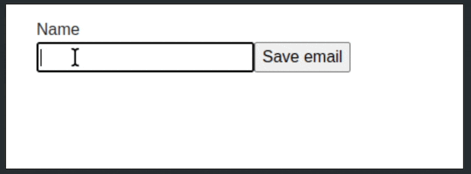

This project implements an inline editing component. If you need to edit a piece of data, you can click on it to enter the editor mode.



A container with the data for editing uses the `data-editable-target` data attribute. The attribute value is the name of the field.

```html
<div data-editable-target="name"><i>name</i></div>
<div data-editable-target="email"><i>email</i></div>
```

Example of a form for saving `name`

```html
<div data-editable-target="name">
  <form>
    <label class="sr-only" for="name">name</label>
    <input type="text" id="name" name="name" value="" />
    <input type="submit" value="Save name" />
  </form>
</div>
```

Example of a form for saving `email`

```html
<div data-editable-target="email">
  <form>
    <label class="sr-only" for="email">email</label>
    <input type="text" id="email" name="email" value="" />
    <input type="submit" value="Save email" />
  </form>
</div>
```

A user has entered `Cat`

```html
<div data-editable-target="name">Cat</div>
```

A user has deleted all values

```html
<div data-editable-target="name"><i>name</i></div>
<div data-editable-target="email"><i>email</i></div>
```
